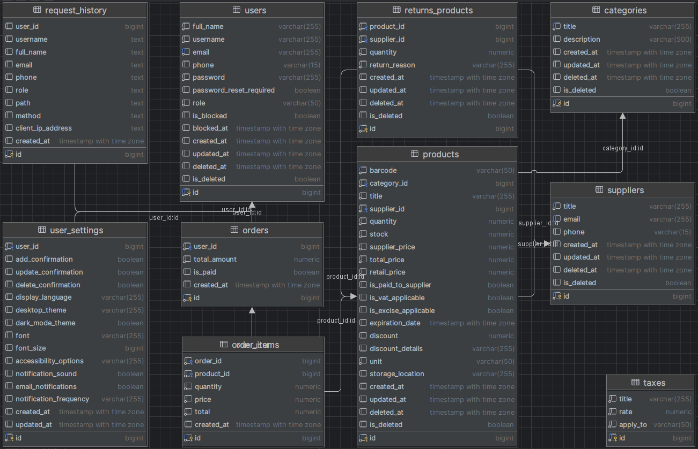
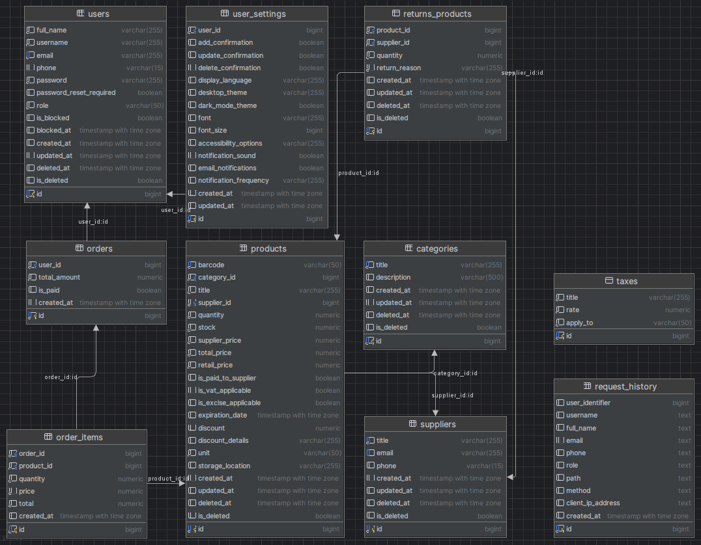

## О проекте

**eShop** — это масштабируемое решение для продуктовых магазинов, которое упрощает управление товарами, заказами и поставщиками. Проект использует современные технологии и предоставляет удобные API для интеграции с другими системами, включая поддержку штрих-кодов и работу с весовыми товарами.


## Приложение:

# eShop

##### _____________________________________

eShop — это серверное приложение для управления заказами, продуктами, налогами и поставщиками в контексте магазина (продуктовые магазины, супермаркеты). Оно предоставляет API для работы с товарами, заказами, возвратами, генерацией штрих-кодов и многим другим.

##### _____________________________________

## Функциональные возможности

- Управление товарами (добавление, обновление, удаление, просмотр)
- Работа с заказами (создание заказа, добавление товаров в заказ, удаление товаров)
- Генерация и обработка штрих-кодов
- Поддержка взвешенных товаров с 18-значными штрих-кодами
- Управление поставщиками и категориями товаров
- Ведение учёта налогов и отчетности
- Авторизация и аутентификация на основе JWT

##### _____________________________________

## Роли пользователей

Приложение поддерживает несколько ролей пользователей для разграничения прав доступа:

### Администратор

- Имеет полный доступ ко всем функциям приложения.
- Может управлять пользователями (создавать, блокировать, восстанавливать), заказами, товарами, поставщиками, категориями и налогами.
- Создаёт новых пользователей и назначает им роли.
- Обладает правами на удаление и восстановление данных.

### Менеджер

- Может управлять товарами, поставщиками и категориями.
- Не имеет доступа к пользователям (не может просматривать, создавать или удалять пользователей).
- Может просматривать заказы, но не изменять их.
- Может управлять инвентаризацией товаров (например, следить за количеством на складе).
- Может просматривать отчёты и статистику.

### Продавец

- Имеет доступ к созданию и управлению заказами.
- Может добавлять товары в заказ, удалять их и отмечать заказы как оплаченные.
- Имеет доступ к электронным весам, подключённым к приложению и базе данных.
- Может работать с возвратами товаров.
- Не имеет доступа к управлению пользователями, поставщиками, категориями и налогами.

##### Примечание

***Роли пользователей реализованы на уровне доступа к роутам с использованием промежуточных функций, описанных в файле middleware.go.***


##### _____________________________________

## Расчёт КТУ
### (Коэффициент Трудового Участия)

Приложение поддерживает расчет КТУ для всех пользователей, занимающихся продажами, включая администраторов, менеджеров и продавцов. КТУ рассчитывается на основе общей суммы продаж каждого пользователя за указанный месяц. Для получения данных необходимо указать год и месяц.

КТУ позволяет оценить вклад каждого сотрудника в общую выручку магазина, что может быть полезно для распределения премий или оценки эффективности.

##### _____________________________________

## Требования

1. Go 1.16+ — основной язык программирования.
2. PostgreSQL — база данных для хранения данных.
3. Swagger — для документирования API.
4. Excelize — для работы с Excel-файлами.
5. GORM — ORM для работы с базой данных.
6. Gin — веб-фреймворк для обработки HTTP-запросов.
7. JWT (JSON Web Tokens) — для аутентификации пользователей.
8. Lumberjack — для ротации логов (если включено логирование с ротацией).

##### _____________________________________

## Стек технологий

* Язык программирования: Go (Golang)
* Веб-фреймворк: Gin
* База данных: PostgreSQL
* ORM: GORM (для взаимодействия с базой данных)
* Миграции базы данных: GORM AutoMigrate
* Аутентификация: JWT (JSON Web Tokens)
* Документация API: Swagger
* Логирование: Стандартное логирование Go (log), плюс библиотека Lumberjack для ротации логов
* Обработка штрих-кодов: Внутренние утилиты для генерации и разбора штрих-кодов
* Работа с файлами Excel: Библиотека excelize для работы с Excel-файлами (для отчетов)
* Работа с архивами: Библиотека archive/zip для обработки ZIP-архивов (для отчетов)
* Хеширование паролей: Использование SHA-256 для хеширования данных (при необходимости можно поменять на более сильные алгоритмы, такие как bcrypt или Argon2)

##### _____________________________________

## Установка

1. Склонируйте репозиторий:

```bash
git clone https://github.com/AndreyBorisovichKoval/eShop.git
cd eShop
```

2. Настройте зависимости:

```bash
go mod tidy
```

3. Приложение автоматически создаёт базу данных и выполняет миграции при первом запуске в случае, если не было создано. Убедитесь, что параметры базы данных указаны правильно в файле конфигурации.

4. Настройте файл конфигурации:

Скопируйте файл `configs/configs.json.example` в `configs/configs.json` и заполните необходимые параметры для подключения к базе данных.

5. Все необходимые таблицы также могут быть созданы автоматически при первом запуске. Дополнительно можно провести миграции:

```bash
go run cmd/app.go migrate
```

##### _____________________________________

## Заполнение тестовыми данными (опционально):

1. Запустите сервер.

2. Воспользуйтесь эндпоинтом для вставки тестовых данных:

```bash
curl -X POST http://localhost:8585/insert-test-data
```

##### _____________________________________

## Запуск приложения

1. Запустите сервер:

```bash
go run main.go
```

2. Приложение будет доступно по умолчанию по адресу: `http://localhost:8585`. 
   Порт можно изменить в файле конфигурации `configs.json`.

##### _____________________________________

## API документация

Документация API доступна по адресу:

```
http://localhost:8585/swagger/index.html
```
* Порт можно изменить в файле конфигурации `configs.json`.

##### _____________________________________

## Тестирование

Вы можете использовать Postman для тестирования API. Коллекция запросов находится в файле:

```
eShop.postman_collection.json
```

##### _____________________________________

## Структура проекта

```
├── cmd                # Точка входа для запуска приложения
├── configs            # Файлы конфигурации
├── db                 # Подключение к базе данных и миграции
├── docs               # Документация Swagger
├── errs               # Пользовательские ошибки
├── logger             # Логирование
├── logs               # Логи приложения
├── models             # Определение моделей базы данных
├── pkg                # Основная логика приложения
│   ├── controllers    # Контроллеры (обработка HTTP-запросов)
│   ├── service        # Бизнес-логика
│   ├── repository     # Логика работы с базой данных (CRUD операции)
├── server             # Настройка сервера
└── utils              # Утилитарные функции
```

### Описание папок:

1. **cmd**: Эта папка содержит точку входа в приложение. Здесь можно найти основной файл, который запускает сервер или выполняет миграции.

2. **configs**: Содержит конфигурационные файлы, такие как параметры для подключения к базе данных, а также настройки приложения.

3. **db**: Отвечает за подключение к базе данных и хранение файлов миграций, необходимых для автоматического создания и изменения схемы базы данных.

4. **docs**: Здесь находится документация API, сгенерированная Swagger. Она используется для упрощенного тестирования и изучения API.

5. **errs**: Модуль для хранения пользовательских ошибок, которые используются в приложении для более точной обработки и отображения ошибок пользователю.

6. **logger**: Настройка логирования приложения. Сюда включены обработчики для записи логов в файлы и настройки ротации логов.

7. **logs**: Эта папка содержит файлы с логами, которые генерируются приложением во время его работы.

8. **models**: В этой папке определяются структуры данных (модели), которые представляют сущности базы данных, такие как пользователь, продукт, заказ.

9. **pkg**: Основная логика приложения, распределенная по трем ключевым слоям:

   * 9.1. **controllers**: Здесь находятся контроллеры, которые обрабатывают входящие HTTP-запросы, вызывают нужные сервисы и возвращают ответы клиентам.
   * 9.2. **service**: В этой папке сосредоточена бизнес-логика, где происходит основная обработка данных и проверка условий.
   * 9.3. **repository**: Здесь находятся функции, работающие напрямую с базой данных для выполнения операций создания, чтения, обновления и удаления данных (CRUD).

10.  **server**: Этот модуль отвечает за настройку и запуск HTTP-сервера, а также за маршрутизацию запросов в нужные контроллеры.

11. **utils**: Утилитарные функции, которые не привязаны к конкретной бизнес-логике, но часто используются в проекте, например, генерация штрих-кодов.

##### _____________________________________

## Переменные окружения

Для работы приложения необходимо задать некоторые переменные окружения. Эти переменные позволяют настроить приложение для первого запуска, а также обеспечить безопасность данных.

1. **ADMIN_PASSWORD** — пароль для создания первого администратора. Этот администратор будет иметь возможность управлять приложением, создавать других пользователей и назначать им роли. Без этого пароля невозможно выполнить управление приложением.

Пример:
```bash
export ADMIN_PASSWORD=your_admin_password
```
2. **JWT_SECRET** — секретный ключ для генерации и валидации JWT токенов. Он используется для обеспечения безопасности аутентификации пользователей.

Пример:
```bash
export JWT_SECRET=your_jwt_secret_key
```
3. **DB_PASSWORD** — пароль для подключения к базе данных PostgreSQL. Этот пароль необходим для доступа к базе данных приложения.

Пример:

```bash
export DB_PASSWORD=your_database_password
```

##### _____________________________________

## Структура таблиц базы данных:

#### Используемый инструмент: Goland
##### (correct name: UserID)


### **Описание** таблиц **и их связей**

**Category** (***categories***)

- Описание: Категория продукта, содержит информацию о названии и описании категории.
- Связь: Один ко многим с таблицей продуктов (Product).

**Order** (***orders***)

- Описание: Представляет заказ, содержит информацию о пользователе, общей сумме и статусе оплаты.
- Связи:
  1. Один ко многим с таблицей заказов пользователя (User);
  2. Один ко многим с элементами заказа (OrderItem).

**OrderItem** (***order_items***)

- Описание: Представляет отдельный товар в заказе, содержит информацию о продукте, количестве и цене.
- Связи:
  1. Много ко одному с таблицей заказов (Order);
  2. Много ко одному с продуктами (Product).

**Product** (***products***)

- Описание: Представляет товар в системе, содержит информацию о цене, количестве и поставщике.
- Связи:
  1. Много ко одному с категорией (Category);
  2. Много ко одному с поставщиком (Supplier);
  3. Один ко многим с элементами заказа (OrderItem).

**RequestHistory** (***request_history***)

- Описание: Сохраняет историю запросов пользователей, включая информацию о пользователе и запросе.
- Связь: Независимая таблица, в которой нет внешних ключей.

**ReturnsProduct** (***returns_products***)

- Описание: Представляет возврат товара поставщику, содержит информацию о причине возврата, продукте и поставщике.
- Связи:
  1. Много ко одному с продуктами (Product);
  2. Много ко одному с поставщиком (Supplier).

**Supplier** (***suppliers***)

- Описание: Представляет поставщика товара, содержит информацию о названии, электронной почте и телефоне.
- Связь: Один ко многим с таблицей продуктов (Product).

**Taxes** (***taxes***)

- Описание: Представляет налоги, такие как НДС или акциз, содержит информацию о ставке налога и области применения (цена или прибыль).
- Связь: Независимая таблица, которая используется для расчетов, не имеет явных связей с другими таблицами.

**UserSettings** (***user_settings***)

- Описание: Хранит настройки пользователя, такие как тема интерфейса, язык и уведомления.
- Связь: Один к одному с таблицей пользователей (User).

**User** (***users***)

- Описание: Представляет пользователя системы, содержит информацию о пользователе, его статусе и роли.
- Связи:
  1. Один ко многим с заказами (Order);
  2. Один к одному с настройками пользователя (UserSettings).

#### Используемый инструмент: Goland
##### (rename field to: UserIdentifier)


##### _____________________________________

## Readme.md

* Файл __README.md__ - это текущий файл, который может быть изменен по мере необходимости, включая сам **"код"**.
* В процессе разработки и возможного обновления проекта, **README.md** может подвергаться изменениям, чтобы отражать ***актуальную информацию о проекте***, его ***функциональности***, ***инструкции по установке*** и ***использованию***, а также другую полезную информацию для **разработчиков** и **пользователей**.
* Это важный компонент документации, который помогает улучшить понимание проекта и содействует его успешному использованию.

##### _____________________________________

## Лицензия

Этот проект распространяется под лицензией [MIT](https://opensource.org/licenses/MIT).

##### _____________________________________

**Create** by: **Andrey Koval** (57)

**Date**: 2024-09-26

**Version**: 01.02

##### _____________________________________


