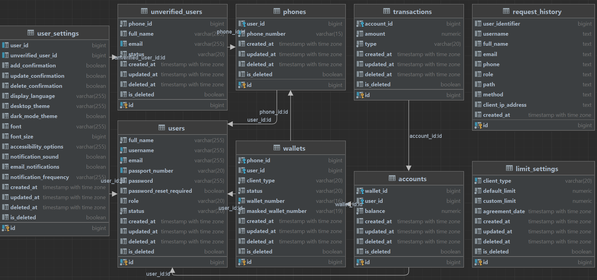

## О проекте

**eWalletGo** (Test Task) — это API для электронной системы кошельков финансового учреждения. Приложение разработано для обработки операций с кошельками, в том числе пополнений и проверки баланса, с учётом индивидуальных и общих лимитов.

## Приложение:

## eWalletGo API

##### _____________________________________

## Функциональные возможности

#### Управление кошельками:

- Проверка существования кошелька.
- Получение текущего баланса.
- Пополнение кошелька с учётом лимитов (индивидуальных и общих).
- Перерасчёт баланса на основе записей транзакций.
- Запись всех операций в транзакции для исторических данных.

#### Учёт и применение лимитов:

- Индивидуальные лимиты для каждого клиента (если задано).
- Общий лимит, установленный по умолчанию для всех кошельков.
- Проверка лимитов при пополнении, с выдачей соответствующих ошибок, если превышен установленный предел.

#### Отчёты по операциям:

- Получение суммарных данных по операциям за текущий или указанный месяц.

##### _____________________________________

## Используемые технологии

- GoLang — основной язык разработки.
- PostgreSQL — система управления базами данных.
- GORM — ORM для Go, для взаимодействия с базой данных.

##### _____________________________________

## Установка

1. Склонируйте репозиторий:

```bash
git clone https://github.com/AndreyBorisovichKoval/eWalletGo.git
```

2. Настройте зависимости:

```bash
go mod tidy
```

3. Приложение автоматически создаёт базу данных и выполняет миграции при первом запуске в случае, если не было создано. Убедитесь, что параметры базы данных указаны правильно в файле конфигурации.

4. Настройте файл конфигурации:

- В файле `configs/configs.json` заполните необходимые параметры для подключения к базе данных.

5. Все необходимые таблицы также будут созданы автоматически при первом запуске. 

##### _____________________________________

## Заполнение тестовыми данными (опционально):

1. Запустите сервер.

2. Воспользуйтесь эндпоинтом для вставки тестовых данных:

```bash
curl -X POST http://localhost:57320/insert-test-data
```

##### _____________________________________

## Запуск приложения

1. Запустите сервер:

```bash
go run main.go
```

2. Приложение будет доступно по умолчанию по адресу: `http://localhost:57320`. 
   Порт можно изменить в файле конфигурации `configs.json`.

##### _____________________________________

## API документация

Документация API доступна по адресу:

```
http://localhost:57320/swagger/index.html
```
* Порт можно изменить в файле конфигурации `configs.json`.

##### _____________________________________

## Тестирование

Вы можете использовать Postman для тестирования API. Коллекция запросов находится в файле:

```
eWalletGo_TestTask.postman_collection.json
```

##### _____________________________________

## Структура проекта

```
eWalletGo_TestTask/
├── config/                             // Конфигурации приложения
├── db/                                 // Подключение к базе данных
├── models/                             // Модели данных
├── pkg/
│   ├── controllers/                    // Контроллеры для обработки запросов
│   ├── repository/                     // Репозиторий для взаимодействия с базой данных
│   ├── service/                        // Сервисный слой для бизнес-логики
├── errs/                               // Пакет кастомных ошибок
├── logger/                             // Пакет логирования
```

Структура организована для разделения конфигурации, моделей, контроллеров, репозиториев, сервисов и вспомогательных пакетов
(ошибки и логирование), что упрощает управление и масштабирование приложения.

##### _____________________________________

## Переменные окружения

**DB_PASSWORD** — пароль для подключения к базе данных PostgreSQL. Этот пароль необходим для доступа к базе данных приложения.

Пример:

```bash
export DB_PASSWORD=your_database_password
```

##### _____________________________________

## Структура таблиц базы данных:

#### Используемый инструмент: Goland


##### _____________________________________

## Readme.md

* Файл __README.md__ - это текущий файл, который может быть изменен по мере необходимости, включая сам **"код"**.
* В процессе разработки и возможного обновления проекта, **README.md** может подвергаться изменениям, чтобы отражать ***актуальную информацию о проекте***, его ***функциональности***, ***инструкции по установке*** и ***использованию***, а также другую полезную информацию для **разработчиков** и **пользователей**.

##### _____________________________________

## Лицензия

Этот проект распространяется под лицензией [MIT](https://opensource.org/licenses/MIT).

##### _____________________________________

**Create** by: **Andrey Koval** (57)

**Date**: 2024-10-26

**Version**: 01.00

##### _____________________________________
